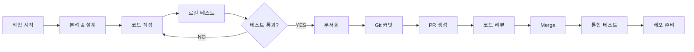

# 🤖 일정모아 개발 에이전트 지침 (Agent.md)

## 1. 프로젝트 미션

### 🎯 주요 목표
**"PDF/이미지에 흩어진 일정을 AI가 읽어서 자동 분류하고, Google Calendar와 통합하여 통합 관리하는 Flutter 앱 구현"**

### ✅ 성공 기준
1. 문서에서 일정 정보 자동 추출 (성공률 90%)
2. AI 분류 정확도 70% 이상 (일정/마감/할 일)
3. Google Calendar 동기화 100% 성공률
4. 사용자가 5분 내 첫 일정 등록 가능
5. 모든 핵심 기능이 동작하는 MVP 완성

---

## 2. 에이전트의 역할

### 🔷 주요 책임
- **코드 생성 & 리팩토링**: 품질 높은 코드 작성
- **아키텍처 설계**: 확장 가능한 구조 제안
- **버그 수정**: 빠른 진단 및 해결
- **문서화**: 코드와 기능에 대한 명확한 설명
- **테스트**: 단위 테스트 & 통합 테스트 작성
- **성능 최적화**: 응답 시간 < 2초 목표

### 🔷 버전 관리
- Git 기반 협업
- 의미있는 커밋 메시지 작성
- 브랜치 전략: `feature/{기능명}`, `bugfix/{문제명}`, `hotfix/{급함}`

### 🔷 협업 방식
- 매일 아침 15분 스탠드업 (우선순위 확인)
- 일일 진행 상황 문서화
- 이슈/블로커 즉시 보고

---

## 3. 기술 스택 상세

### 백엔드 (Python/FastAPI)
```
├── Core Framework: FastAPI
├── Database: SQLAlchemy ORM + PostgreSQL
├── Authentication: OAuth 2.0 (Google)
├── AI/LLM: Azure OpenAI SDK
├── File Processing:
│   ├── PDF: pdf2image, PyPDF2
│   ├── OCR: pytesseract (Tesseract engine)
│   ├── Image: Pillow
│   └── Documents: python-docx
├── Calendar: google-auth-oauthlib, google-api-python-client
├── Async Jobs: APScheduler (또는 Celery + Redis)
├── Validation: Pydantic
├── Testing: pytest, pytest-asyncio
└── API Docs: Swagger/OpenAPI (자동 생성)
```

### 프론트엔드 (Flutter/Dart)
```
├── Core: Flutter 3.10+, Dart 3.0+
├── State Management: Riverpod 2.0+ (권장)
├── UI/Material: Material 3
├── Calendar: table_calendar 또는 syncfusion
├── HTTP Client: dio 또는 http
├── Local Storage: shared_preferences, hive
├── Secure Storage: flutter_secure_storage
├── File Handling: image_picker, file_picker
├── Notifications: flutter_local_notifications
├── Auth: google_sign_in
├── Testing: flutter test, integration_test
└── Build: flutter build apk/ios/web
```

### 데이터베이스 (PostgreSQL)
```
├── Version: 13+
├── ORM: SQLAlchemy
├── Migrations: Alembic
├── Indexes: 성능 최적화
├── Transactions: ACID 준수
└── Backup: 일일 자동 백업
```

---

## 4. 개발 워크플로우

### 📋 일일 작업 순서

```
1. [09:00] 스탠드업 → 우선순위 확인
2. [09:15] 어제 이슈 정리 & 오늘 할 일 로드
3. [09:30] 코딩 시작 (집중 시간)
4. [12:30] 점심시간 (1시간)
5. [13:30] 코딩 재개 (집중 시간)
6. [17:00] 일일 커밋 & 문서 업데이트
7. [17:30] 내일 준비 & 이슈 정리
8. [18:00] 퇴근
```

### 🔄 작업 단위 프로세스



### 📌 각 단계별 체크리스트

#### 1️⃣ 분석 & 설계
- [ ] 요구사항 명확하게 이해
- [ ] 관련 파일/모듈 식별
- [ ] 영향 범위 파악
- [ ] 테스트 케이스 정의

#### 2️⃣ 코드 작성
- [ ] 컨벤션 준수 (아래 참고)
- [ ] 타입 힌팅/주석 추가
- [ ] 에러 처리 포함
- [ ] 로깅 추가

#### 3️⃣ 로컬 테스트
- [ ] 단위 테스트 작성
- [ ] 엣지 케이스 테스트
- [ ] 성능 테스트
- [ ] 보안 검토 (필요시)

#### 4️⃣ 문서화
- [ ] README 업데이트
- [ ] 코드 주석 추가
- [ ] API 명세 업데이트
- [ ] 아키텍처 다이어그램 (필요시)

#### 5️⃣ 커밋
- [ ] 의미있는 메시지
- [ ] 관련 이슈 링크
- [ ] 한 커밋 = 한 논리적 변화

---

## 5. 코딩 컨벤션

### Python/FastAPI

#### 파일 구조
```
backend/
├── app/
│   ├── __init__.py
│   ├── main.py                 # 앱 진입점
│   ├── config.py               # 환경 설정
│   ├── models/                 # SQLAlchemy 모델
│   │   ├── user.py
│   │   ├── document.py
│   │   ├── extracted_item.py
│   │   └── __init__.py
│   ├── schemas/                # Pydantic 스키마
│   │   ├── user.py
│   │   ├── document.py
│   │   ├── extracted_item.py
│   │   └── __init__.py
│   ├── api/                    # API 라우터
│   │   ├── auth.py
│   │   ├── documents.py
│   │   ├── extracted_items.py
│   │   ├── calendars.py
│   │   ├── notifications.py
│   │   └── __init__.py
│   ├── services/               # 비즈니스 로직
│   │   ├── ai_classifier.py
│   │   ├── google_calendar.py
│   │   ├── notifications.py
│   │   ├── document_processor.py
│   │   └── __init__.py
│   ├── core/                   # 핵심 유틸리티
│   │   ├── database.py
│   │   ├── security.py
│   │   ├── dependencies.py
│   │   └── __init__.py
│   └── utils/                  # 헬퍼 함수
│       ├── logger.py
│       ├── validators.py
│       └── __init__.py
├── tests/
│   ├── unit/
│   ├── integration/
│   └── conftest.py
├── requirements.txt
├── .env.example
└── Dockerfile
```

#### 네이밍 컨벤션
```python
# ✅ Good
async def extract_text_from_pdf(file_path: str) -> str:
    """PDF 파일에서 텍스트를 추출합니다."""
    pass

class DocumentProcessor:
    def process_document(self, file: UploadFile) -> DocumentUploadResponse:
        pass

# ❌ Bad
async def extractTextFromPDF(filePath):
    pass

class doc_processor:
    def PROCESS_DOCUMENT(self):
        pass
```

#### 타입 힌팅 & 주석
```python
from typing import Optional, List
from fastapi import FastAPI, HTTPException

# ✅ Good
async def classify_item(
    text: str,
    user_id: str,
    confidence_threshold: float = 0.7
) -> List[ExtractedItem]:
    """
    텍스트를 분석하여 일정/마감/할 일으로 분류합니다.
    
    Args:
        text: 분석할 텍스트
        user_id: 사용자 ID
        confidence_threshold: 신뢰도 임계값 (기본 0.7)
    
    Returns:
        분류된 항목 리스트
    
    Raises:
        ValueError: 입력 텍스트가 비어있을 경우
    """
    if not text:
        raise ValueError("텍스트가 비어있습니다.")
    
    items: List[ExtractedItem] = []
    # 분류 로직...
    return items
```

#### 에러 처리
```python
# ✅ Good
from fastapi import HTTPException, status

@router.post("/documents/upload")
async def upload_document(file: UploadFile):
    try:
        if not file.filename.endswith('.pdf'):
            raise HTTPException(
                status_code=status.HTTP_400_BAD_REQUEST,
                detail="PDF 파일만 지원합니다."
            )
        
        content = await file.read()
        # 처리...
        return {"success": True}
    
    except FileNotFoundError:
        raise HTTPException(
            status_code=status.HTTP_404_NOT_FOUND,
            detail="파일을 찾을 수 없습니다."
        )
    except Exception as e:
        logger.error(f"문서 업로드 실패: {str(e)}")
        raise HTTPException(
            status_code=status.HTTP_500_INTERNAL_SERVER_ERROR,
            detail="서버 오류가 발생했습니다."
        )
```

### Dart/Flutter

#### 파일 구조
```
frontend/
├── lib/
│   ├── main.dart               # 앱 진입점
│   ├── config/
│   │   ├── app_config.dart
│   │   ├── api_config.dart
│   │   └── routes.dart
│   ├── models/
│   │   ├── user_model.dart
│   │   ├── document_model.dart
│   │   ├── extracted_item_model.dart
│   │   └── dashboard_model.dart
│   ├── providers/              # Riverpod 프로바이더
│   │   ├── auth_provider.dart
│   │   ├── document_provider.dart
│   │   ├── extracted_item_provider.dart
│   │   ├── calendar_provider.dart
│   │   └── dashboard_provider.dart
│   ├── screens/
│   │   ├── home_screen.dart
│   │   ├── document_upload_screen.dart
│   │   ├── classification_review_screen.dart
│   │   ├── dashboard_screen.dart
│   │   ├── calendar_screen.dart
│   │   ├── todo_list_screen.dart
│   │   └── settings_screen.dart
│   ├── widgets/
│   │   ├── common/
│   │   │   ├── app_bar.dart
│   │   │   ├── navigation_drawer.dart
│   │   │   └── loading_indicator.dart
│   │   ├── document/
│   │   │   ├── document_upload_widget.dart
│   │   │   └── file_drop_zone.dart
│   │   ├── extracted_item/
│   │   │   ├── extracted_item_card.dart
│   │   │   ├── item_type_selector.dart
│   │   │   └── item_editor.dart
│   │   ├── dashboard/
│   │   │   ├── today_schedules_widget.dart
│   │   │   ├── upcoming_deadlines_widget.dart
│   │   │   └── todo_list_widget.dart
│   │   └── calendar/
│   │       └── calendar_view_widget.dart
│   ├── services/
│   │   ├── api_service.dart
│   │   ├── auth_service.dart
│   │   ├── document_service.dart
│   │   ├── calendar_service.dart
│   │   └── notification_service.dart
│   ├── utils/
│   │   ├── constants.dart
│   │   ├── logger.dart
│   │   ├── date_formatter.dart
│   │   └── validators.dart
│   └── theme/
│       ├── app_theme.dart
│       └── colors.dart
├── test/
│   ├── unit/
│   ├── widget/
│   └── integration/
├── pubspec.yaml
└── .env.example
```

#### 네이밍 컨벤션
```dart
// ✅ Good
class ExtractedItemCard extends StatelessWidget {
  final ExtractedItem item;
  final VoidCallback onTap;
  
  const ExtractedItemCard({
    required this.item,
    required this.onTap,
  });
  
  @override
  Widget build(BuildContext context) {
    // ...
  }
}

String formatDate(DateTime date) => DateFormat('yyyy-MM-dd').format(date);

// ❌ Bad
class extracted_item_card extends StatelessWidget {
  // ...
}

String FORMATDATE(DateTime date) => '';
```

#### 주석 & 문서화
```dart
// ✅ Good

/// 추출된 항목을 카드 형태로 표시하는 위젯입니다.
/// 
/// [item] 매개변수는 필수이며, [onTap] 콜백은 카드 클릭 시 호출됩니다.
class ExtractedItemCard extends StatelessWidget {
  /// 표시할 추출 항목
  final ExtractedItem item;
  
  /// 카드 클릭 시 실행될 콜백
  final VoidCallback onTap;
  
  const ExtractedItemCard({
    required this.item,
    required this.onTap,
  });
  
  @override
  Widget build(BuildContext context) {
    // ...
  }
}

/// 날짜를 'YYYY-MM-DD' 형식으로 포맷팅합니다.
/// 
/// Example:
/// ```dart
/// formatDate(DateTime(2026, 8, 1)); // '2026-08-01'
/// ```
String formatDate(DateTime date) => DateFormat('yyyy-MM-dd').format(date);
```

#### 에러 처리
```dart
// ✅ Good
try {
  final response = await apiService.uploadDocument(file);
  return response;
} on SocketException catch (e) {
  logger.error('네트워크 오류: $e');
  throw NetworkException('인터넷 연결을 확인하세요.');
} on TimeoutException catch (_) {
  logger.error('요청 시간 초과');
  throw TimeoutException('요청이 시간 초과되었습니다. 다시 시도해주세요.');
} catch (e) {
  logger.error('예상치 못한 오류: $e');
  throw Exception('문서 업로드 중 오류가 발생했습니다.');
}
```

---

## 6. 문제 해결 접근법

### 🔍 버그 발견 시 절차

```
1. 현상 파악
   - 정확한 에러 메시지 확인
   - 재현 단계 문서화
   - 환경 정보 수집 (OS, 버전, 브라우저 등)

2. 원인 분석
   - 로그 추적 (console, server logs)
   - 데이터 상태 확인 (DB, 캐시)
   - 네트워크 요청/응답 검사
   - 스택 트레이스 해석

3. 임시 해결책 vs 근본 원인
   - 긴급 버그 → 임시 해결책 + 티켓 생성
   - 일반 버그 → 근본 원인 파악 후 해결

4. 테스트
   - 단위 테스트 추가
   - 회귀 테스트 (같은 버그 재발 방지)
   - 엣지 케이스 테스트

5. 문서화
   - 버그 원인 기록
   - 해결 방법 설명
   - 유사 버그 방지 방안
```

### 🚨 차단 이슈(Blocker) 처리

**즉시 (1시간 내):**
1. 담당자에 보고
2. 근본 원인 분석 시작
3. 임시 우회 방법 검토

**1시간 내 해결 불가능:**
1. 상위 우선순위 업무 일시 중단
2. 팀 전체에 알림
3. 함께 디버깅 세션 진행

---

## 7. 우선순위 & MoSCoW

### MUST (필수) - 1주차 내 완성
- [ ] 문서 업로드 & OCR
- [ ] AI 일정 분류 (일정/마감/할 일)
- [ ] 추출 결과 수정 기능
- [ ] Google Calendar 동기화
- [ ] 통합 대시보드

### SHOULD (높음) - 2주차 내 완성
- [ ] 알림 시스템
- [ ] 캘린더 뷰
- [ ] 할 일 완료 & 피드백
- [ ] 예외 처리 & 에러 메시지

### COULD (선택) - 3-4주차
- [ ] 고급 알림 규칙
- [ ] 반복 일정
- [ ] 통계 & 분석
- [ ] 다크 모드

### WON'T (제외)
- [ ] 모바일 네이티브 앱 (Flutter Web으로 대체)
- [ ] 팀 협업 (개인용 MVP)
- [ ] AI 자동 학습 (1차 제외)

---

## 8. 성능 기준

### 응답 시간 목표
```
문서 업로드          < 5초
OCR 처리             < 3초
AI 분류              < 5초
Google Calendar 동기화 < 2초
대시보드 로드         < 1초
캘린더 뷰 렌더링      < 2초
```

### 리소스 사용
```
Backend CPU:  < 50% (일반 부하)
Backend Memory: < 500MB
Frontend App Size: < 50MB (Android), < 40MB (iOS)
Database Size: < 1GB (초기)
```

### 테스트 커버리지
```
Unit Tests:        최소 70%
Integration Tests: 핵심 기능 100%
API Endpoints:     모든 경로 테스트
```

---

## 9. 커뮤니케이션 & 보고

### 📊 일일 보고 (매일 17:00)
```
작업 완료:
- ✅ 기능명 완료 (파일: xxx.py)
- ✅ 버그 수정 (이슈: #123)

진행 중:
- 🔄 기능명 (진행도: 60%, 예상 완료: 내일)

블로커:
- 🚫 문제 설명 (담당자: @유저)
- 🚫 필요 정보/결정

내일 예정:
- 📅 할 일 1, 할 일 2
```

### 🎯 주간 점검 (매주 금요일)
- 주차 목표 달성도
- 이슈 사항 및 배운 점
- 다음 주 조정사항

### 🔴 위기 상황 보고 (즉시)
- 배포 불가 상태
- 보안 이슈
- 데이터 손실 위험
- 3시간 이상 지속 차단 이슈

---

## 10. 테스트 가이드

### 단위 테스트 (Unit Tests)

#### Python 예시
```python
import pytest
from app.services.ai_classifier import classify_text

@pytest.mark.asyncio
async def test_classify_text_schedule():
    """일정으로 정확히 분류되는지 테스트"""
    text = "내일 오후 2시 회의가 있습니다."
    result = await classify_text(text)
    
    assert len(result) == 1
    assert result[0].item_type == "schedule"
    assert result[0].due_time == "14:00"

@pytest.mark.asyncio
async def test_classify_text_deadline():
    """마감으로 정확히 분류되는지 테스트"""
    text = "8월 15일까지 보고서를 제출해야 합니다."
    result = await classify_text(text)
    
    assert len(result) == 1
    assert result[0].item_type == "deadline"
    assert result[0].due_date == "2026-08-15"
```

#### Dart 예시
```dart
import 'package:flutter_test/flutter_test.dart';
import 'package:schedule_moa/models/extracted_item_model.dart';
import 'package:schedule_moa/services/api_service.dart';

void main() {
  group('ExtractedItemModel', () {
    test('itemType이 schedule으로 설정되어야 함', () {
      final item = ExtractedItem(
        id: '1',
        title: '회의',
        itemType: ItemType.schedule,
        dueDate: DateTime(2026, 8, 2),
      );
      
      expect(item.itemType, equals(ItemType.schedule));
    });
    
    test('우선순위가 1-5 범위여야 함', () {
      final item = ExtractedItem(
        id: '1',
        title: '작업',
        itemType: ItemType.todo,
        priority: 3,
      );
      
      expect(item.priority, greaterThanOrEqualTo(1));
      expect(item.priority, lessThanOrEqualTo(5));
    });
  });
}
```

### 통합 테스트 (Integration Tests)

```python
# test_document_flow.py
@pytest.mark.asyncio
async def test_full_document_flow(client, user_id):
    """전체 문서 처리 흐름 테스트"""
    
    # 1. 문서 업로드
    with open("sample.pdf", "rb") as f:
        response = await client.post(
            "/api/documents/upload",
            files={"file": f},
            data={"user_id": user_id}
        )
    assert response.status_code == 200
    doc_id = response.json()["documentId"]
    
    # 2. AI 분류 확인
    response = await client.get(f"/api/documents/{doc_id}/items")
    assert response.status_code == 200
    items = response.json()
    assert len(items) > 0
    
    # 3. Google Calendar 동기화
    response = await client.post(
        f"/api/documents/{doc_id}/sync",
        json={"calendar_id": "primary"}
    )
    assert response.status_code == 200
```

---

## 11. 배포 체크리스트

### 프리 배포 (Pre-Deployment)
```
[ ] 모든 테스트 통과 (unit, integration, e2e)
[ ] 코드 리뷰 완료
[ ] 보안 검사 완료
[ ] 성능 테스트 통과
[ ] 데이터베이스 마이그레이션 검증
[ ] 환경 변수 설정 확인
[ ] 로깅 레벨 설정 (DEBUG → INFO)
[ ] 민감 정보 제거 (API 키, 비밀번호)
[ ] 문서 업데이트
```

### 배포 중 (During Deployment)
```
[ ] 데이터베이스 백업
[ ] 서비스 헬스 체크
[ ] 트래픽 모니터링
[ ] 에러 로그 감시
[ ] 실시간 사용자 피드백
```

### 포스트 배포 (Post-Deployment)
```
[ ] 핵심 기능 수동 테스트
[ ] 사용자 피드백 수집
[ ] 성능 메트릭 확인
[ ] 모니터링 알림 활성화
[ ] 롤백 계획 준비
```

---

## 12. 문서화 요구사항

### 필수 문서
- **README.md**: 프로젝트 설명, 설치, 실행 방법
- **ARCHITECTURE.md**: 시스템 아키텍처, 데이터 흐름
- **API.md**: API 엔드포인트, 요청/응답 스키마
- **DATABASE.md**: 데이터베이스 스키마, 관계도
- **DEVELOPMENT.md**: 로컬 개발 환경 설정
- **TROUBLESHOOTING.md**: 일반적인 문제 및 해결책

### 코드 내 문서화
```
- 모든 함수/메소드: 목적, 매개변수, 반환값 설명
- 복잡한 로직: 왜(Why), 어떻게(How) 설명
- 상수: 값의 의미 설명
- 예외 처리: 어떤 경우에 어떤 에러가 발생하는지 설명
```

---

## 13. 개발 환경 체크리스트

### 백엔드 개발자
```
[ ] Python 3.11+ 설치
[ ] PostgreSQL 13+ 설치 (또는 Docker)
[ ] pip 최신 버전
[ ] FastAPI, SQLAlchemy 설치
[ ] Azure OpenAI API 키 발급
[ ] Google OAuth 설정
[ ] IDE: VS Code, PyCharm 등
[ ] 디버거: pdb, debugpy
```

### 프론트엔드 개발자
```
[ ] Flutter 3.10+ 설치
[ ] Android Studio 또는 Xcode
[ ] Dart SDK 3.0+
[ ] flutter doctor 실행 및 모든 항목 체크
[ ] iOS 에뮬레이터 또는 Android 에뮬레이터
[ ] 실제 기기 연결 테스트
[ ] IDE: VS Code + Flutter Extension, Android Studio
```

### 공통
```
[ ] Git 설치 및 설정
[ ] SSH 키 생성 (GitHub)
[ ] 프로젝트 클론
[ ] .env 파일 생성 (.env.example 참고)
[ ] 데이터베이스 연결 테스트
[ ] API 서버 실행 확인
```

---

## 14. 빠른 참고 (Cheat Sheet)

### Git 명령어
```bash
# 새 기능 시작
git checkout -b feature/document-upload

# 일일 커밋
git add .
git commit -m "feat: 문서 업로드 기능 구현

- PDF/이미지 파일 지원
- OCR로 텍스트 추출
- 데이터베이스 저장"

# PR 생성 전
git push origin feature/document-upload

# 완료 후 머지
git checkout main
git pull origin main
git merge feature/document-upload
git push origin main
```

### 디버깅 팁
```python
# 로깅 활용
import logging
logger = logging.getLogger(__name__)
logger.debug(f"처리할 텍스트: {text}")

# 중단점 (Python)
import pdb; pdb.set_trace()

# 타입 확인
print(type(variable), variable)
```

```dart
// 로깅
import 'package:logger/logger.dart';
final logger = Logger();
logger.d('디버그 정보: $variable');

// 중단점
debugger();

// 타입 확인
print('${variable.runtimeType}: $variable');
```

### 데이터베이스
```bash
# 마이그레이션
alembic revision --autogenerate -m "테이블 추가"
alembic upgrade head

# 데이터베이스 조회
psql -U postgres -d schedule_moa
\dt                    # 테이블 목록
SELECT * FROM users;   # 데이터 조회
```

---

## 15. 최종 체크리스트 (MVP 완성 전)

### 기능 완성도
```
[ ] 문서 업로드 & OCR 동작 (3개 샘플 PDF 테스트)
[ ] AI 분류 정확도 70% 이상 확인
[ ] Google Calendar 동기화 100% 성공
[ ] 대시보드 데이터 정확성 확인
[ ] 알림 발송 & 수신 확인
[ ] 할 일 완료 애니메이션 작동
[ ] 예외 처리 완료 (모든 엣지 케이스)
```

### 코드 품질
```
[ ] 단위 테스트 70% 커버리지
[ ] 통합 테스트 핵심 기능 100%
[ ] 코드 리뷰 완료
[ ] 보안 취약점 없음
[ ] 성능 기준 통과
[ ] 린팅 규칙 준수
```

### 배포 준비
```
[ ] Docker 이미지 빌드 성공
[ ] 환경 변수 모두 설정
[ ] 데이터베이스 마이그레이션 검증
[ ] README 및 문서 완성
[ ] 샘플 데이터 준비
[ ] 발표 슬라이드 준비
```

### 팀 커뮤니케이션
```
[ ] 일일 보고 기록 완성
[ ] 이슈/학습 사항 문서화
[ ] 최종 검증 회의 완료
[ ] 배포 승인 받음
```

---

## 📞 문의 및 도움말

**🤔 뭔가 불명확한가?**
1. 이 문서 다시 읽기
2. PRD.md, MVP.md 확인
3. 팀원에게 물어보기
4. 이슈 생성하기

**🆘 기술적 문제?**
- Python: 공식 문서, StackOverflow, FastAPI 튜토리얼
- Dart/Flutter: Flutter 문서, Pub.dev
- 데이터베이스: PostgreSQL 튜토리얼, SQLAlchemy 문서

**📈 지속적 개선**
- 이 문서는 매주 업데이트됩니다.
- 피드백은 언제든지 환영합니다.
- 좋은 아이디어는 즉시 반영됩니다.

---

**작성일**: 2026-08-01  
**버전**: 1.0  
**다음 리뷰**: 2026-08-08
